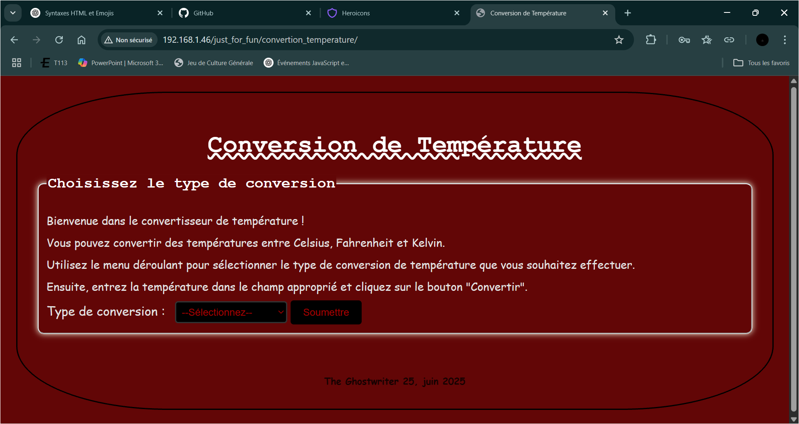

# 🌡️ CalculTemperature

Un petit projet web personnel pour convertir des températures entre **Celsius (°C)**, **Fahrenheit (°F)** et **Kelvin (K)**.

Ce site a été créé dans le cadre de mon apprentissage HTML/CSS/JavaScript, et il est hébergé sur un serveur **Debian personnel** via **Apache2**.

---

## 🧮 Fonctionnalités

- Conversion automatique de :
  - °C vers °F et K
  - °F vers °C et K
  - K vers °C et °F
- Champs de saisie simples
- Calcul instantané via JavaScript
- Code propre, lisible et commenté

---

## 💻 Aperçu

 <!-- Optionnel si tu ajoutes une capture d'écran -->

---

## 🖥️ Détails techniques

- 🔧 **Technologies** :
  - HTML
  - CSS
  - JavaScript

- 🚫 **Non responsive** :  
  Ce site n’est pas adapté aux petits écrans. Il est conçu uniquement pour affichage sur ordinateur de bureau.

- 📁 **Déploiement local** :
  Le projet est déployé localement dans `/var/www/html/` sur un serveur **Debian** avec **Apache2**.

---

## 🚀 Lancer le projet en local

1. Copier les fichiers HTML, CSS et JS dans le dossier :

- CalculTemperature
